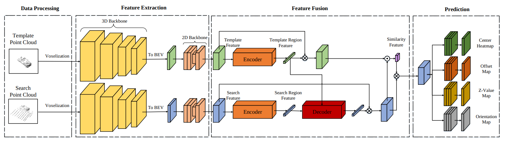

# 3D Object Tracking with Transformer
## Overview

- [Introduction](#introduction)
- [Performance](#performance)
- [Setup](#setup)
- [QuickStart](#quickstart)
- [Acknowledgment](#acknowledgment)
- [Citation](#citation)

## Introduction

This is the official code release of "**3D Object Tracking with Transformer**"(**Accepted** as Contributed paper in **[BMVC 2021](https://www.bmvc2021-virtualconference.com/)**) [Paper](https://www.bmvc2021-virtualconference.com/assets/papers/1445.pdf)

### Abstract
Feature fusion and similarity computation are two core problems in 3D object tracking, especially for object tracking using sparse and disordered point clouds. Feature fusion could make similarity computing more efficient by including target object information. However, most existing LiDAR-based approaches directly use the extracted point cloud feature to compute similarity while ignoring the attention changes of object regions during tracking. In this paper, we propose a feature fusion network based on transformer architecture. Benefiting from the self-attention mechanism, the transformer encoder captures the inter- and intra- relations among different regions of the point cloud. By using cross-attention, the transformer decoder fuses features and includes more target cues into the current point cloud feature to compute the region attentions, which makes the similarity computing more efficient. Based on this feature fusion network, we propose an end-to-end point cloud object tracking framework, a simple yet effective method for 3D object tracking using point clouds.



## Performance

Here, we show the latest performance of our LTTR. In order to better open source our code, we reconstruct the code and optimized some parameters compared to the version in the paper, and the performances are as follows:

### Kitti Dataset

|           | Car  | Ped  | Van  | Cyclist  | Mean  |
| --------- | ---- | ---- | ---- | -------- | ----- |
| Success   | 68.6 | 45.5 | 39.5 | 70.7     | 56.1  |
| Precision | 79.2 | 70.6 | 45.2 | 90.6     | 72.7  |

The pretrained model could be downloaded at this [Link](https://drive.google.com/drive/folders/1eQN0V3I87VOUkAS5TB373ywTXZH00ALl?usp=sharing)
## Setup

### Installation

   ```bash
   conda create -n lttr python=3.8 -y
   conda activate lttr
   conda install pytorch==1.8.1 torchvision==0.9.1 torchaudio==0.8.1 cudatoolkit=10.2 -c pytorch
   
   # please refer to https://github.com/traveller59/spconv
   pip install spconv-cu102

   git clone https://github.com/3bobo/lttr
   cd lttr/
   pip install -r requirements.txt

   python setup.py develop
   ```

### Dataset preparation

   Download the dataset from [KITTI Tracking](http://www.cvlibs.net/datasets/kitti/eval_tracking.php) and organize the downloaded files as follows:

   ```bash
   lttr                                           
   |-- data                                     
   |   |-- kitti                                                                          
   │   │   └── training
   │   │       ├── calib
   │   │       ├── label_02
   │   │       └── velodyne
   
   ```

## QuickStart

### Train

For training, you can customize the training by modifying the parameters in the yaml file of the corresponding model, such as '**CLASS_NAMES**'.

After configuring the yaml file, run the following command to parser the path of config file and the training tag.

```bash
cd lttr/tools
# python train.py --cfg_file cfgs/kitti_models/car.yaml --extra_tag car
python train.py --cfg_file $model_config_path
```

*By default, we use a single Nvidia RTX 3090 for training.*

For training with ddp, you can execute the following command ( ensure be root dir ):

```bash
cd lttr/tools
bash scripts/dist_train.sh $NUM_GPUs --cfg_file $model_config_path
```

### Eval

```bash
cd lttr/tools
# for single model
python test.py --cfg_file $model_config_path --ckpt $your_saved_ckpt
# for all saved model
python test.py --cfg_file $model_config_path --ckpt $your_saved_ckpt --eval_all
```

The evaluation results are saved to the same path as the model, such as 'output/kitti_models/car'.

## Acknowledgment

- This repo is built upon [P2B](https://github.com/HaozheQi/P2B) and [OpenPCDet](https://github.com/open-mmlab/OpenPCDet). 
- Thank [lucidrains](https://github.com/lucidrains) for his implementation of [TNT](https://github.com/lucidrains/transformer-in-transformer). 
## Citation

If you find the project useful for your research, you may cite,

```
@inproceedings{lttr,
    author    = {Yubo Cui and Zheng Fang and Jiayao Shan and Zuoxu Gu and Sifan Zhou},
    title     = {3D Object Tracking with Transformer},
    booktitle = {32nd British Machine Vision Conference 2021, {BMVC} 2021, Online,
                November 22-25, 2021},
    pages     = {317},
    publisher = {{BMVA} Press},
    year      = {2021},
    }
```
